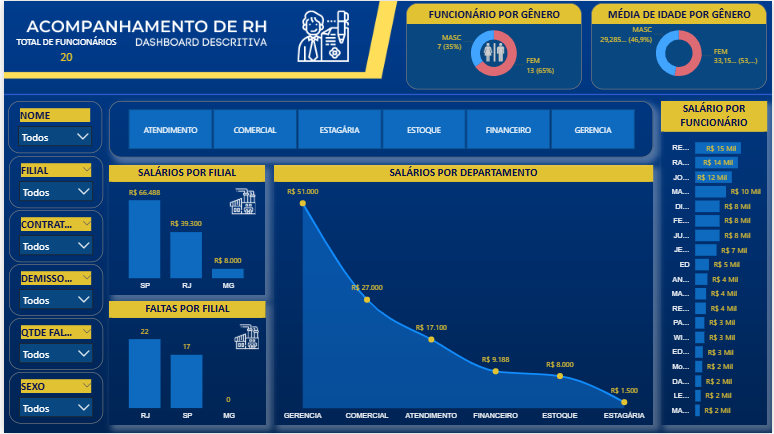

# Dashboard-de-Acompanhamento-de-RH-M-dulo-1
Dashboard desenvolvido no Power BI no Módulo 1 do curso, para acompanhamento de indicadores de RH, como presença, desempenho e férias. Permite visualização clara e interativa dos dados, consolidando informações para facilitar análises e decisões.

## Visualização do Dashboard

